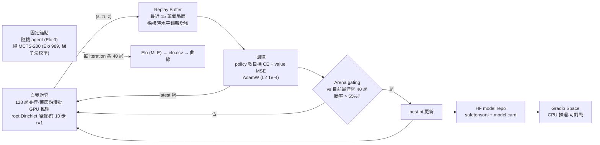
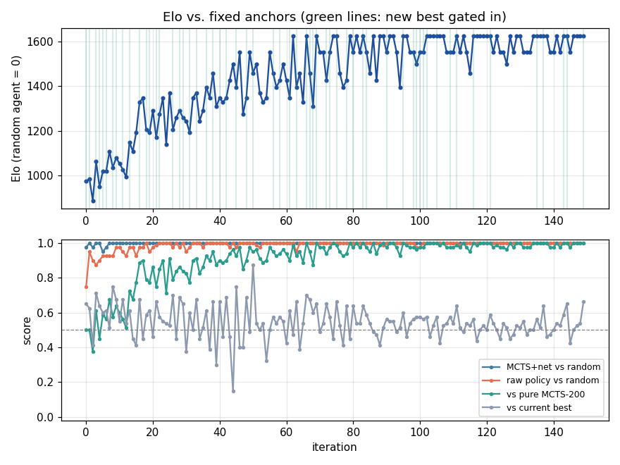
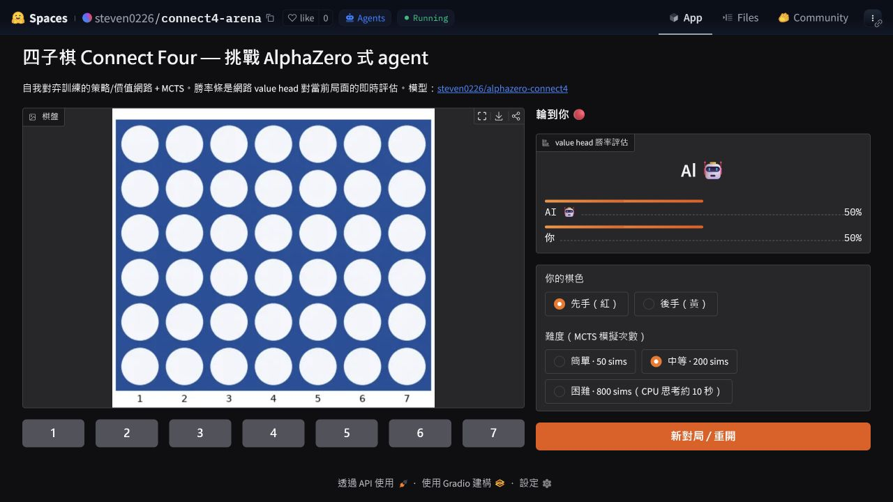

# alphazero-connect4

從零開始（無任何人類棋譜）用 **AlphaZero 式自我對弈**訓練一個四子棋（Connect Four, 6×7）agent，
並部署成 [Hugging Face Space](https://huggingface.co/spaces/steven0226/connect4-arena) 讓任何人上網跟它對戰。


> **English TL;DR** — A from-scratch AlphaZero-style Connect Four agent trained from 19,200
> self-play games with batched PUCT MCTS and a policy/value ResNet. The final model reached
> Elo **1625.6** and beat the fixed MCTS-200 anchor consistently. On 100 deterministic,
> non-trivial positions scored by an independent exact solver, best-move accuracy rose from
> **74% policy-only to 82% with MCTS-800**. A live
> [Hugging Face Space](https://huggingface.co/spaces/steven0226/connect4-arena) is available.

## 結果一覽

| 證據 | 結果 |
|---|---:|
| 正式自我對弈 | 19,200 局、150 iterations、7.92 小時 |
| 最終 Elo | **1625.6**（隨機 = 0、純 MCTS-200 = 989） |
| 精確解算器最佳落子命中率 | policy **74%** → MCTS-50 **77%** → MCTS-200 **80%** → MCTS-800 **82%** |
| 線上成果 | [可玩的 Hugging Face Space](https://huggingface.co/spaces/steven0226/connect4-arena) |

這裡同時保留了[完整 150 輪原始資料](results/elo_full.csv)、
[可重現摘要](results/full_run_summary.md)與[逐盤精確解算器評測](results/solver_benchmark.md)，
因此成果不只是一張挑選過的曲線。

## AlphaZero 三要素（白話版）

1. **自我對弈（self-play）**：agent 沒有老師，自己跟自己下棋。每一步都記下「當時的盤面、
   搜尋後認為每一欄該下的機率 π、這局最後誰贏 z」，這三樣就是訓練資料——資料品質會隨
   agent 變強而變好，形成正向循環。
2. **MCTS（蒙地卡羅樹搜尋）**：下每一步之前，先在腦中「推演」幾十到幾百個變化。推演不是
   亂試：由神經網路的 policy 引導往有希望的分支走（PUCT），由 value 評估不用走到終局就知道
   好壞。搜尋的結論（各欄訪問次數）比網路的直覺更強——**搜尋結果就成了網路的訓練標籤**。
3. **雙頭網路（policy + value）**：一個小 ResNet 吃盤面（我方棋/對方棋/輪到誰三個平面），
   同時輸出「該下哪」（policy，7 欄 softmax，非法欄 mask 掉）與「這局面多好」（value，
   tanh ∈ [-1,1]）。網路變強 → 搜尋更準 → 產生更強的訓練資料 → 網路再變強。

## 訓練閉環



## 專案結構

```
src/az/            canonical 核心套件（唯一手寫來源）
  game.py          bitboard 引擎（Pascal Pons 佈局、哨兵列、O(1) 落子與勝負判定）
  model.py         策略/價值 ResNet（6 blocks × 96 filters，~1.1M 參數）+ 批次 evaluator
  mcts.py          PUCT 樹搜尋（evaluator 可插拔：神經網 / 隨機 rollout / 均勻）
  selfplay.py      多局 lockstep 並行、每 tick 一次 GPU forward 的自我對弈 pool
  replay.py        緊湊 replay buffer（~25 bytes/局面），採樣時對稱增強
  train.py         訓練迴圈：checkpoint 原子輪替、--resume、--max-hours
  arena.py         批次化對戰（隨機 / 純 MCTS / 最佳網錨點）、gating
  elo.py           對錨點的 MLE Elo（勝率截斷防無限大）
  viz.py           棋盤渲染與 Elo 曲線（Space 與 GIF 共用）
tests/             36 個核心／結果測試 + 8 個 Space release-boundary 測試
space/             Gradio app 與部署設定；space/az 是發布時生成的 bundle
scripts/           錨點 Elo 校準、精確解算器 benchmark、結果摘要、GIF、Elo 圖、HF 發佈
alphazero_connect4_colab_train.ipynb  Colab A100 訓練薄封裝
```

## 怎麼訓練

**本機（開發／驗證）**

```bash
python -m venv .venv && .venv/Scripts/activate
pip install torch --index-url https://download.pytorch.org/whl/cu121   # Windows CUDA
pip install -e ".[dev]"
pytest tests -q                      # 44 tests：36 既有 + 8 release-boundary
python -m az.train --preset smoke    # ~40 分鐘 @ RTX 2070，驗證學習訊號
```

**Colab A100（正式重訓）**：開 [alphazero_connect4_colab_train.ipynb](alphazero_connect4_colab_train.ipynb)，加 `HF_TOKEN` secret，
先 `SMOKE_TEST=True` 跑 10 分鐘驗證管線並實測吞吐，再改 `False` Run all 過夜（設計階段估計
6–10 小時 ≈ 150–280 iterations；**實測**跑滿 150 個 iteration 花了 7.92 小時，落在估計區間
內但偏保守——對局變強後平均手數變多、自我對弈變慢，`--max-hours` 建議抓寬一點。checkpoint
落 Drive，斷線重跑即續。結束自動 push 權重與 Elo 曲線到
[steven0226/alphazero-connect4](https://huggingface.co/steven0226/alphazero-connect4) 並釋放 runtime。

## 真實訓練數據（Colab A100，FULL，150 iterations / 7.9 小時）

正式配置（6 blocks × 96 filters、128 局/iter、160 sims）跑滿全部 150 個 iteration，
共 19,200 局自我對弈，59/150 個 iteration 通過 gating 更新最佳權重：

| 指標 | iteration 0 | iteration 149（最終） |
|---|---|---|
| Elo（隨機 agent = 0、純 MCTS-200 = 989 錨定） | 974 | **1625.6**（iter 62 首次達峰；最後 50 輪平均 1593.6） |
| 裸 policy（不搜尋）vs 隨機 | 0.75 | **1.00** |
| MCTS+網 vs 隨機 | 0.975 | **1.00** |
| vs 純 MCTS-200 錨點 | 0.50 | **1.00**（iter 69 起每輪皆 ≥0.9，後段多為全勝） |
| vs 前一版最佳網（gating） | 0.65 | 0.6625（gated） |



**最終版本穩定打贏純 MCTS-200 錨點**——這是規劃階段設定的目標，目前的部署權重已達成。

完整數值與摘要可由下列命令重新產生：

```bash
python scripts/summarize_full_run.py
```

<details>
<summary>本機 SMOKE 驗證（RTX 2070，40 iterations／~26 分鐘，正式訓練前的管線健檢）</summary>

SMOKE 用縮小配置（3 blocks × 64 filters、24 局/iter、64 sims）確認自我對弈→訓練→評估
→gating→Elo 全流程有真實學習訊號，再進到 Colab 正式訓練：

| 指標 | iteration 0 | iteration 39 |
|---|---|---|
| Elo | 709 | 974（峰值 1008） |
| 裸 policy vs 隨機 | 0.80 | 0.82–0.95 |
| MCTS+網 vs 隨機 | 0.95 | 1.00 |
| vs 純 MCTS-200 錨點 | 0.20 | 0.50 |


</details>

## 精確解算器外部評測（筆電 CPU，100 個局面）

Elo 只表示「相對於選定對手有多強」，不能保證每步都正確。因此另用獨立的
[`connect-four-ai`](https://github.com/benjaminrall/connect-four-ai) 完美解算器，
對 100 個固定 seed、橫跨第 10/14/18/22/26 手、且沒有一步必勝的非終局盤面，取得每個合法
落子的精確分數。模型若選到任何一個並列最高分的落子即算命中：

| 方法 | 精確最佳落子 | 命中率 [Wilson 95% CI] |
|---|---:|---:|
| 裸 policy | 74/100 | **74%** [64.6%, 81.6%] |
| MCTS-50 | 77/100 | **77%** [67.8%, 84.2%] |
| MCTS-200 | 80/100 | **80%** [71.1%, 86.7%] |
| MCTS-800 | 82/100 | **82%** [73.3%, 88.3%] |

點估計隨搜尋預算單調提升；配對上 policy 獨有 3 題正確、MCTS-800 獨有 11 題正確，但 exact
McNemar `p=0.0574`，所以 100 盤仍不足以宣稱兩者差異達 0.05 顯著。800 sims 也有 18% 未命中，
因此「強但非完美」是較準確的結論。逐盤 move string、oracle 七欄分數、模型選擇與 CPU timing
都在 [`results/solver_benchmark.json`](results/solver_benchmark.json)。

使用 Python 3.13+ 可完整重跑：

```bash
python -m pip install -r requirements-oracle.txt
python scripts/benchmark_solver_moves.py --positions 100 --budgets 50 200 800
```

## 線上對戰

🎮 **[connect4-arena Space](https://huggingface.co/spaces/steven0226/connect4-arena)** —
選先後手與難度（50 / 200 / 800 sims），畫面即時顯示 value head 對局勢的勝率評估。



本機試玩：`python scripts/run_space_local.py checkpoints/smoke/best.pt`

### Space 來源邊界與可重現發布

- `src/az` 是 **canonical source**；修改引擎、MCTS 或推理程式時只改這裡。
- `space/az` 是 `scripts/deploy_space.py` 從 `src/az` 完整重建的
  **generated deployment bundle**，已 gitignore，不應手動修改或當成第二份原始碼。
- Space 預設從 model repo commit
  [`0ba2361fe4044af9f6bfadfa89997b46191077c7`](https://huggingface.co/steven0226/alphazero-connect4/tree/0ba2361fe4044af9f6bfadfa89997b46191077c7)
  同時下載 `config.json` 與 `model.safetensors`；不跟隨可變的 `main`。如要更新模型，
  先把 `space/model_assets.py` 的 `DEFAULT_MODEL_REVISION` 改成新的 40 字元 commit SHA，
  再重跑下列驗證；`MODEL_REVISION` 環境變數也只接受 commit SHA。

可審核的發布準備流程（不會上傳）：

```bash
python -m pip install -e ".[dev,hub]"
python -m pytest tests -q
python scripts/deploy_space.py --dry-run
```

`--dry-run` 會刪除現有 `space/az`、從 canonical tree 重建乾淨 bundle，然後停在本機。
只有在取得對外發布授權後，才移除 `--dry-run` 執行同一個腳本。

> 開發過程的實測：SMOKE 早期權重 + 200 sims 就在對戰中用「雙重威脅」（一手同時做出兩個
> 連四點）擊敗了作者；50 sims 檔則可以被殘局 zugzwang 戰術擊敗——難度分層符合預期。正式
> FULL 權重（~110 萬參數，比 SMOKE 大 3 倍多）部署後實測：CPU 上「困難 · 800 sims」單步
> 回應約 2 秒，遠低於設計階段估計的 6–15 秒上限，難度最高檔位在免費 CPU Space 上依然順暢。

## 設計筆記

- **Bitboard**：每欄 7 bits（6 列 + 哨兵列防跨欄誤判），勝負判定 = 4 個方向各 2 次
  shift+AND，狀態是可 hash 的 `(position, mask)` int tuple。
- **批次化 MCTS**：訓練吞吐的關鍵。128 局 lockstep 前進，每 tick 每局選一條路徑到葉節點，
  所有葉湊成一個 batch 做一次 GPU forward（單 tick 單次 H2D/D2H）。每樹每 tick 只有一葉
  在途，天然免 virtual loss。2070 實測 ~23k evals/s。
- **視角約定**（AlphaZero 最大 bug 來源）：value 一律是「該局面輪到走的人」的期望結果；
  backup 沿路徑逐層變號；z 逐 ply 變號。tests/test_mcts.py 的「必須擋」案例就是抓這類符號
  錯誤的守門員。
- **Elo 錨定**：純 MCTS-200 錨點的絕對 Elo 用梯子法校準（隨機↔MCTS-16↔MCTS-64↔MCTS-200
  各 200 局），直接打隨機 agent 會撞 100% 勝率截斷量不出來。

## 限制（誠實聲明）

- 四子棋是已解遊戲（先手必勝），本 agent 強但**非完美**——超出搜尋預算的深層戰術可能擊敗它；
  部署的 Space 難度上限也只有 800 sims（CPU 推理成本考量），不是不計代價的最強設定。
- 40 局 arena 的單點勝率有 ~±8% 抽樣雜訊：Elo 曲線的鋸齒是統計噪音，趨勢才有意義；
  gating 也因此是粗篩（真 60% 的網約 31% 機率被擋下）——自我對弈用 latest 網，gating 只決定
  發佈權重，誤判不會累積傷害。
- Elo 大約在 iteration 60~100 後進入平原（穩定在 ~1600 附近、vs 純 MCTS-200 錨點全勝），
  之後的 iteration 主要是鞏固而非持續攀升——這與 Connect Four 狀態空間有限、160 sims 搜尋
  在此規模下已接近能榨出的上限一致，不是訓練故障；要再往上推可能需要更大網路或更深搜尋，
  而非單純拉長 iteration 數。
- 這次 FULL 訓練 150 個 iteration 實跑 7.92 小時，非常接近 `--max-hours 8` 的預算上限
  （對局變強後平均每局手數變多、自我對弈變慢）；若之後要一次訓練更多 iteration，預算需要
  對應調高，否則可能被時間上限提前打斷收尾。

## License

本專案原始碼為 [MIT](LICENSE)；依賴套件與選用精確解算器的授權與用途說明見
[`THIRD_PARTY_NOTICES.md`](THIRD_PARTY_NOTICES.md)。
