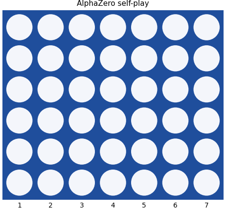
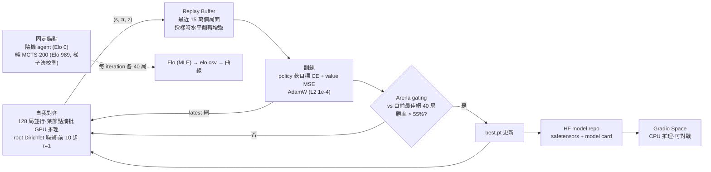
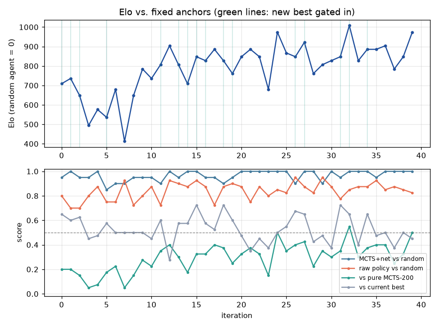

# alphazero-connect4

從零開始（無任何人類棋譜）用 **AlphaZero 式自我對弈**訓練一個四子棋（Connect Four, 6×7）agent，
並部署成 [Hugging Face Space](https://huggingface.co/spaces/steven0226/connect4-arena) 讓任何人上網跟它對戰。



## AlphaZero 三要素（白話版）

1. **自我對弈（self-play）**：agent 沒有老師，自己跟自己下棋。每一步都記下「當時的盤面、
   搜尋後認為每一欄該下的機率 π、這局最後誰贏 z」，這三樣就是訓練資料——資料品質會隨
   agent 變強而變好，形成正向循環。
2. **MCTS（蒙地卡羅樹搜尋）**：下每一步之前，先在腦中「推演」幾十到幾百個變化。推演不是
   亂試：由神經網路的 policy 引導往有希望的分支走（PUCT），由 value 評估不用走到終局就知道
   好壞。搜尋的結論（各欄訪問次數）比網路的直覺更強——**搜尋結果就成了網路的訓練標籤**。
3. **雙頭網路（policy + value）**：一個小 ResNet 吃盤面（我方棋/對方棋/輪到誰三個平面），
   同時輸出「該下哪」（policy，7 欄 softmax，非法欄 mask 掉）與「這局面多好」（value，
   tanh ∈ [-1,1]）。網路變強 → 搜尋更準 → 產生更強的訓練資料 → 網路再變強。

## 訓練閉環



## 專案結構

```
src/az/            核心套件
  game.py          bitboard 引擎（Pascal Pons 佈局、哨兵列、O(1) 落子與勝負判定）
  model.py         策略/價值 ResNet（6 blocks × 96 filters，~1.1M 參數）+ 批次 evaluator
  mcts.py          PUCT 樹搜尋（evaluator 可插拔：神經網 / 隨機 rollout / 均勻）
  selfplay.py      多局 lockstep 並行、每 tick 一次 GPU forward 的自我對弈 pool
  replay.py        緊湊 replay buffer（~25 bytes/局面），採樣時對稱增強
  train.py         訓練迴圈：checkpoint 原子輪替、--resume、--max-hours
  arena.py         批次化對戰（隨機 / 純 MCTS / 最佳網錨點）、gating
  elo.py           對錨點的 MLE Elo（勝率截斷防無限大）
  viz.py           棋盤渲染與 Elo 曲線（Space 與 GIF 共用）
tests/             29 個單元測試（連四各方向、平手、非法步、一步殺、必須擋…）
space/             Gradio 對戰 app（獨立部署到 HF Space）
scripts/           錨點 Elo 校準、GIF、Elo 畫圖、HF 發佈
train_colab.ipynb  Colab A100 訓練薄封裝
```

## 怎麼訓練

**本機（開發／驗證）**

```bash
python -m venv .venv && .venv/Scripts/activate
pip install torch --index-url https://download.pytorch.org/whl/cu121   # Windows CUDA
pip install -e ".[dev]"
pytest tests -q                      # 29 tests
python -m az.train --preset smoke    # ~40 分鐘 @ RTX 2070，驗證學習訊號
```

**Colab A100（正式重訓）**：開 [train_colab.ipynb](train_colab.ipynb)，加 `HF_TOKEN` secret，
先 `SMOKE_TEST=True` 跑 10 分鐘驗證管線並實測吞吐，再改 `False` Run all 過夜（6–10 小時 ≈
150–280 iterations；checkpoint 落 Drive，斷線重跑即續）。結束自動 push 權重與 Elo 曲線到
[steven0226/alphazero-connect4](https://huggingface.co/steven0226/alphazero-connect4) 並釋放 runtime。

## 真實訓練數據（本機 SMOKE，RTX 2070，40 iterations / ~26 分鐘）

SMOKE 用縮小配置（3 blocks × 64 filters、24 局/iter、64 sims）驗證整條管線的學習訊號：

| 指標 | iteration 0 | iteration 39 |
|---|---|---|
| Elo（隨機 agent = 0、純 MCTS-200 = 989 錨定） | 709 | **974**（峰值 1008） |
| 裸 policy（不搜尋）vs 隨機 | 0.80 | **0.82–0.95** |
| MCTS+網 vs 隨機 | 0.95 | **1.00** |
| vs 純 MCTS-200 錨點 | 0.20 | **0.50** |



正式 A100 訓練（6 blocks × 96、160 sims、150+ iterations）的曲線與權重見
[model repo](https://huggingface.co/steven0226/alphazero-connect4)。

## 線上對戰

🎮 **[connect4-arena Space](https://huggingface.co/spaces/steven0226/connect4-arena)** —
選先後手與難度（50 / 200 / 800 sims），畫面即時顯示 value head 對局勢的勝率評估。

*（截圖佔位：Space 上線後補）*

本機試玩：`python scripts/run_space_local.py checkpoints/smoke/best.pt`

> 開發過程的實測：SMOKE 早期權重 + 200 sims 就在對戰中用「雙重威脅」（一手同時做出兩個
> 連四點）擊敗了作者；50 sims 檔則可以被殘局 zugzwang 戰術擊敗——難度分層符合預期。

## 設計筆記

- **Bitboard**：每欄 7 bits（6 列 + 哨兵列防跨欄誤判），勝負判定 = 4 個方向各 2 次
  shift+AND，狀態是可 hash 的 `(position, mask)` int tuple。
- **批次化 MCTS**：訓練吞吐的關鍵。128 局 lockstep 前進，每 tick 每局選一條路徑到葉節點，
  所有葉湊成一個 batch 做一次 GPU forward（單 tick 單次 H2D/D2H）。每樹每 tick 只有一葉
  在途，天然免 virtual loss。2070 實測 ~23k evals/s。
- **視角約定**（AlphaZero 最大 bug 來源）：value 一律是「該局面輪到走的人」的期望結果；
  backup 沿路徑逐層變號；z 逐 ply 變號。tests/test_mcts.py 的「必須擋」案例就是抓這類符號
  錯誤的守門員。
- **Elo 錨定**：純 MCTS-200 錨點的絕對 Elo 用梯子法校準（隨機↔MCTS-16↔MCTS-64↔MCTS-200
  各 200 局），直接打隨機 agent 會撞 100% 勝率截斷量不出來。

## 限制（誠實聲明）

- 四子棋是已解遊戲（先手必勝），本 agent 強但**非完美**——超出搜尋預算的深層戰術可能擊敗它。
- 40 局 arena 的單點勝率有 ~±8% 抽樣雜訊：Elo 曲線的鋸齒是統計噪音，趨勢才有意義；
  gating 也因此是粗篩（真 60% 的網約 31% 機率被擋下）——自我對弈用 latest 網，gating 只決定
  發佈權重，誤判不會累積傷害。
- SMOKE 權重（目前 repo 展示數據）只到「與純 MCTS-200 錨點五五開」；「穩定打贏錨點」
  需要正式 A100 訓練，若正式跑完仍未穩定超越，會照實更新此節與 model card。

## License

MIT
